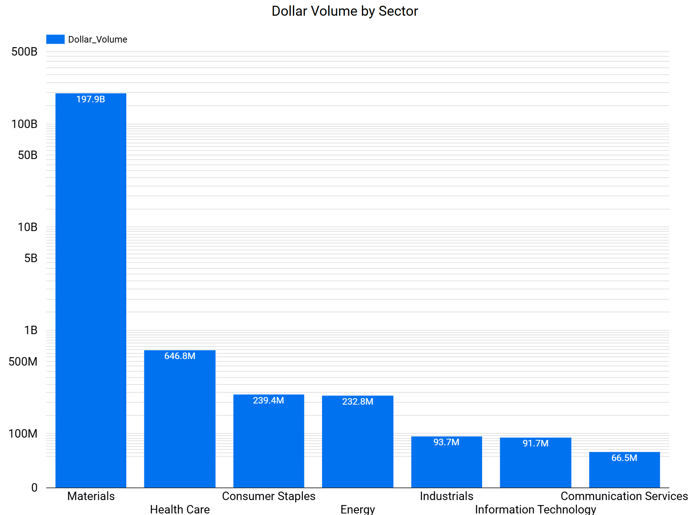
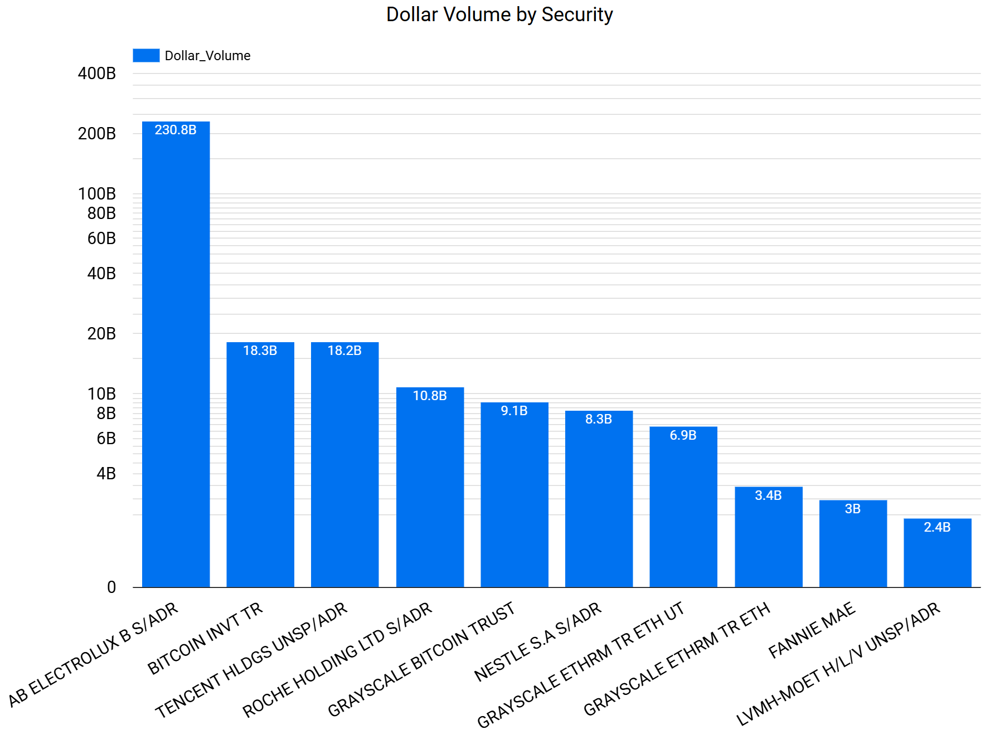
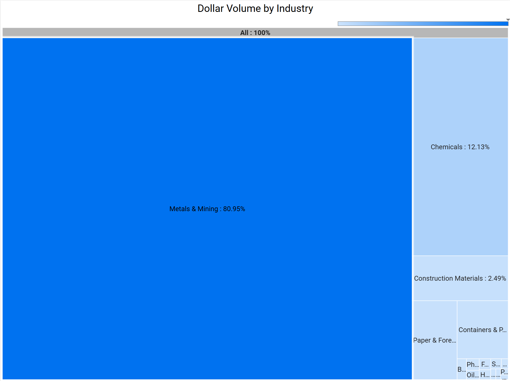
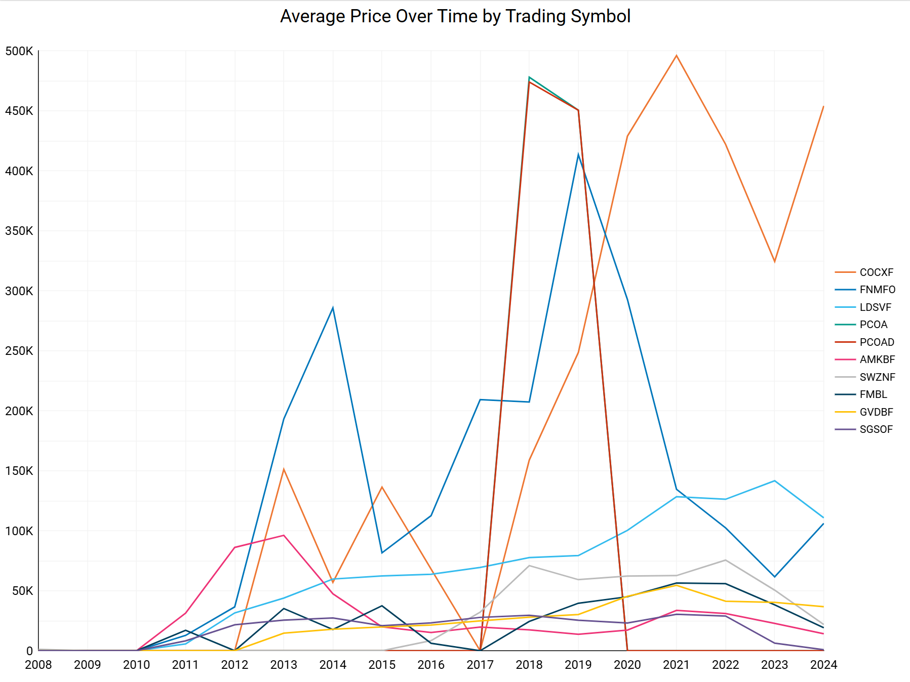

# Visualizations Overview

This folder contains visualizations related to dollar volume, and average prices.

## Structure
1. **charts/**: Final chart images for easy review.
2. **dashboards/**: Contains a link to the Looker Studio interactive dashboard.
3. **readme.md**: Documentation.

## Visualizations
1. **Dollar Volume by Sector**
   
   - Insight: Materials sector leads with 197.9B.
2. **Dollar Volume by Security**
   
   - Insight: AB ELECTROLUX B S/ADR dominates with 230.8B.
3. **Dollar Volume by Industry**
   
   - Insight: Metals & Mining makes up 80.95% of the total.
4. **Average Price Over Time by Trading Symbol**
   
   - Insight: Displays trends for various trading symbols over time.

## Interactive Dashboard
[View on Looker Studio](https://lookerstudio.google.com/reporting/a45c370d-5933-4161-8707-0b5132dee9e3)

## Tools Used
- **Google Looker Studio**: For interactive dashboards.
